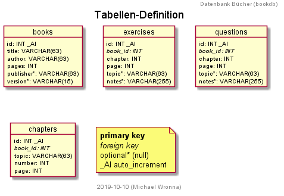

# bookdb - Bücher-Datenbank für Lehr-Materialien

Diese Datenbank wurde entworfen als Begleit-Projekt für den Kurs "Softwareentwickler PHP & MySQL"
bei der GFN im Jahre 2019 in Freiburg.

Die Datenbank wird ständig weiterentwickelt und wird sich im Laufe der Zeit im Umfang und der
Funktionalität erweitern. Gerne könnt ihr mit Vorschläge, Daten, Ideen oder Korrekturen dazu
[beitragen](issues).

## Tabellen

## Anleitung

1.	Ihr solltet zuerst mit dem SQL_Skript `sql/create-database.sql` die Datenbank erstellen und dann
2.	Die Tabellen mit `sql/create-tables.sql` die benötigten Tabellen erzeugen.
3.	Anschliessend könnt ihr mit `sql/insert-data.sql` die Datenbank mit Daten füllen.

## Versionen

*	**v0.0.1:** Erste Version, noch nicht optimiert, die ersten Daten eingefügt
